# Bima Framework

Bima Framework utilize [gRPC Gateway](https://grpc-ecosystem.github.io/grpc-gateway) to make REST easier and added some features for productivity.

## Features

- [gRPC Gateway](https://grpc-ecosystem.github.io/grpc-gateway)

- CRUD Generator

- Authentication and Authorization (using Middleware)

- Support RDBMS (using [Gorm](https://gorm.io)) and MongoDB (using [mgm](https://github.com/Kamva/mgm))

- Soft Deletable (only for RDBMS)

- Support [Elasticsearch](https://github.com/olivere/elastic) and [Pub/Sub](https://github.com/ThreeDotsLabs/watermill) Out of The Box

- [Event Dispatcher](https://en.wikipedia.org/wiki/Observer_pattern)

- Auto documentation (Swagger)

- [Dependency Injection](https://github.com/sarulabs/dingo)

- Two Level Middleware (Global or Per Route)

- Better Log Management

- Support Custom Route

- Support [HTTP Compression](https://github.com/CAFxX/httpcompression) Out of The Box

- Health Check

- Easy to Custom

### Requirements

- Go 1.16 or above

- Git

- [Bima Cli](https://github.com/bimalabs/cli)

- [gRPC Gateway](https://github.com/grpc-ecosystem/grpc-gateway)

- RDBMS (by default only supports `mysql` and `postgresql`) or MongoDB for database storage

- Elasticsearch (Optional)

### Video

Check the [video](https://www.youtube.com/watch?v=zZPpDizZGIM)

### Installation

- Install [Bima Cli](https://github.com/bimalabs/cli)

- Check and/or install toolchain using `bima makesure`

### Basic Usage

- Create new project using `bima create app <name>`

- Move to app folder and run `bima run` command

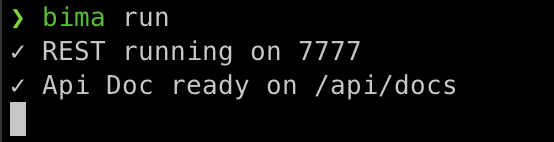

- Open your browser and open `http://localhost:7777/api/docs`

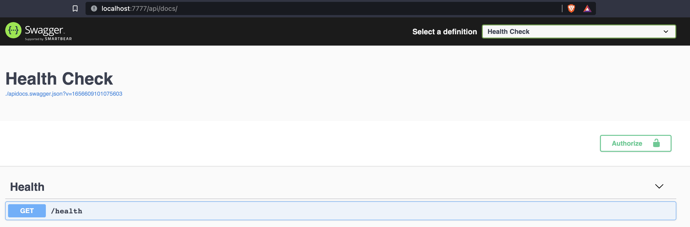

## Connect to Database

I assume you use `mysql` as driver

- Create `bima_skeleton` database

- Add `DB_DRIVER`, `DB_HOST`, `DB_PORT`, `DB_NAME`, `DB_USER`, and `DB_PASSWORD` to `.env`

```bash
DB_DRIVER=mysql
DB_HOST=localhost
DB_PORT=3306
DB_NAME=bima_skeleton
DB_USER=root
DB_PASSWORD=aden
```

- Rerun your service using `bima run` and you got new message `Database configured using mysql driver` like below

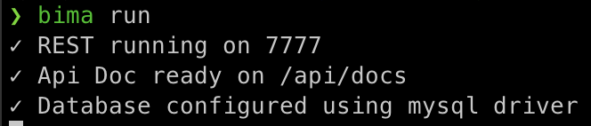

### Create New Module

- Run `bima module add todo` that `todo` is your module name

- Follow the instructions 

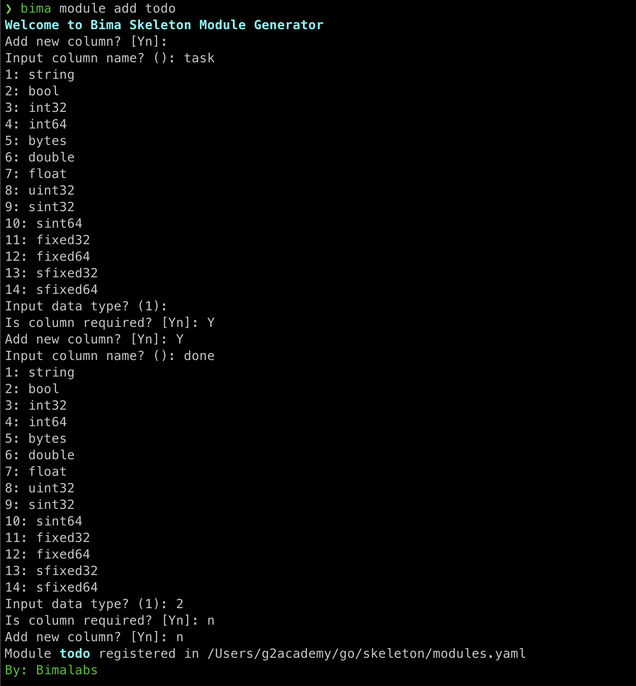

- Bima will generate `todos` folder as your module space, creating `protos/todo.proto`, register your module in `configs/modules.yaml` and register your Dependency Injection defined in `dic.go` into `configs/provider.go`

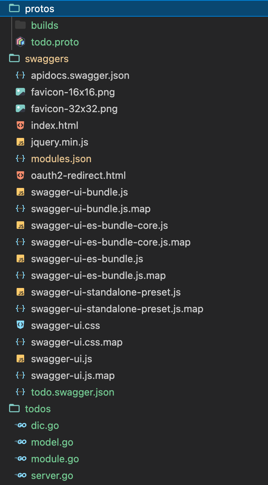

- Run `bima run` and refresh your browser

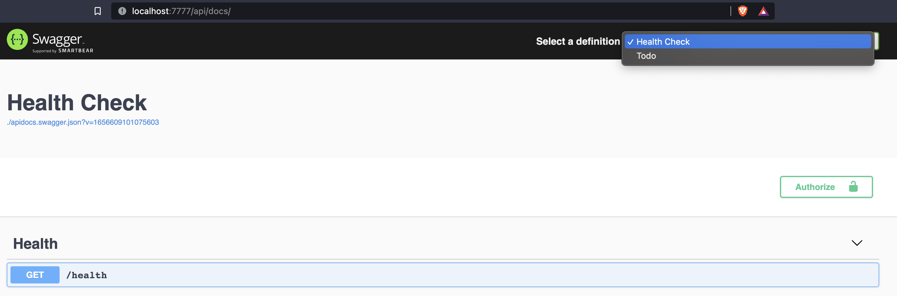

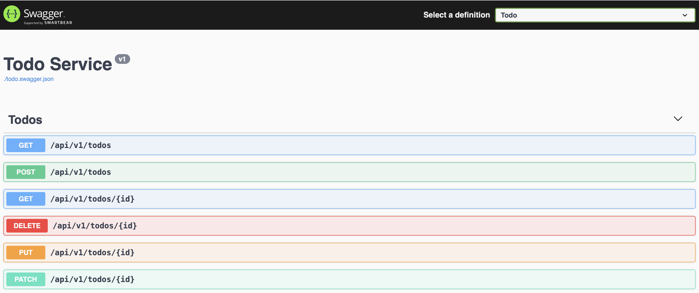

Now you can test your module directly from swagger.

### Cache Get By ID Result

By default, get by ID (single) result is cached by Bima and invalidate using `PUT` or `DELETE` when ID matches. By default, cache lifetime is `0` (no cache), you can easly adjust by adding `CACHE_LIFETIME` to your `.env`

```bash
CACHE_LIFETIME=1020
```

### Register Request Filter

Try to call `/api/v1/todos?fields=task&values=xxx` and do not effect like below 


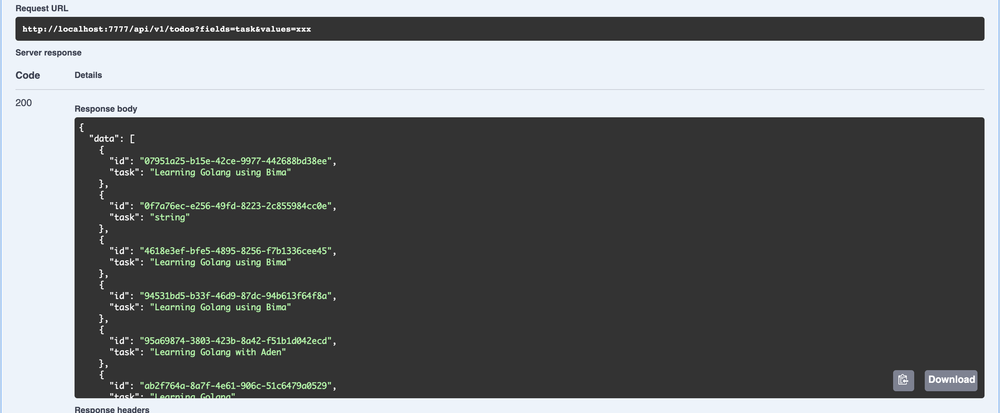

Because by default skeleton doesn't provide filter. To apply request filter, you need to register your own filter or just use filter that provided by bima.

First, i assume you are use `mysql` or `postgresql` as driver, you need to add code below into your `todos/dic.go`

```go
// import "github.com/bimalabs/framework/v4/listeners"
{
    Name:  "bima:listener:filter:gorm",
    Scope: bima.Application,
    Build: (*listeners.GormFilter)(nil),
},
```

We use [Dingo](https://github.com/sarulabs/dingo) to manage dependencies, you can refer to dedicated documentation to learn about Dependency Injectin using Dingo. Then you need to register the `bima:listener:filter:gorm` to your `configs/listeners.yaml`

```yaml
listeners:
    - filter:gorm # `bima:listener:` prefix is reserved by skeleton 
```

Now, you can rerun using `bima run` and try `/api/v1/todos?fields=task&values=xxx` and then the result like below


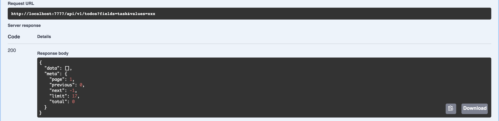

You can easy to create your own filter by implement `Listener` interface

```go
Listener interface {
    Handle(event interface{}) interface{}
    Listen() string
    Priority() int
}
```

The available events are below

```go
PaginationEvent   = Event("pagination")
BeforeCreateEvent = Event("before_create")
BeforeUpdateEvent = Event("before_update")
BeforeDeleteEvent = Event("before_delete")
AfterCreateEvent  = Event("after_create")
AfterUpdateEvent  = Event("after_update")
AfterDeleteEvent  = Event("after_delete")
```

You can refer to [listeners](https://github.com/bimalabs/listeners) for example

### Your first middleware

When you call `/api/v1/todos` you get response header like below

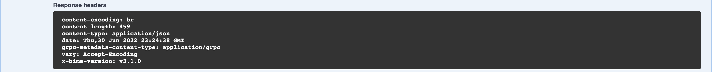

For example, you want to add `X-Middleware` to your response header, first step, create file `middleware.go` in your `todos` folder and paste codes below

```go
package todos

import (
	"net/http"
)

type Middleware struct {
}

func (a *Middleware) Attach(_ *http.Request, response http.ResponseWriter) bool {
	response.Header().Add("X-Middleware", "My first middleware")

	return false
}

func (a *Middleware) Priority() int {
	return 0
}

```

And then, register your middleware into `todos/dic.go`

```go
{
    Name:  "bima:middleware:todo",
    Scope: bima.Application,
    Build: (*Middleware)(nil),
},
```

Last, register your middleware to `configs/middlewares.yaml`

```yaml
middlewares:
    - todo
```

Now, you can rerun using `bima run` and try `/api/v1/todos` and then the result like below

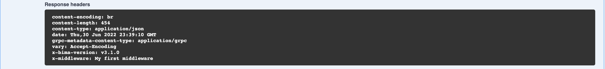

Very easy, right? You can create anything by implement `Middleware` interface below

```go
Middleware interface {
    Attach(request *http.Request, response http.ResponseWriter) bool
    Priority() int
}
```

You can create middleware with easy by typing `bima create middleware <name>` from terminal

### Add new route

For example, you want to add new page `/api/v1/todos/hello/{name}` that response `Hello <name>` string, first add `route.go` to your `todos` folder

```go
package todos

import (
	"bytes"
	"net/http"

	"github.com/bimalabs/framework/v4/middlewares"
	"google.golang.org/grpc"
)

type HelloWorld struct {
}

func (a *HelloWorld) Path() string {
	return "/api/v1/todos/hello/{name}"
}

func (a *HelloWorld) Method() string {
	return http.MethodGet
}

func (a *HelloWorld) SetClient(client *grpc.ClientConn) {}

func (a *HelloWorld) Middlewares() []middlewares.Middleware {
	return nil
}

func (a *HelloWorld) Handle(w http.ResponseWriter, r *http.Request, params map[string]string) {
	w.Write([]byte("Hello " + params["name"]))
}

```

And then, register your middleware into `todos/dic.go`

```go
{
    Name:  "bima:route:hello",
    Scope: bima.Application,
    Build: (*HelloWorld)(nil),
},
```

Last, register your middleware to `configs/routes.yaml`


```yaml
routes:
    - hello
```

Rerun using `bima run` and open `/api/v1/todos/hello/bima` and then the result like below

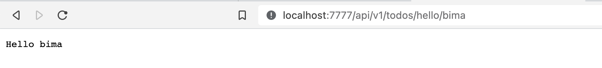


You can create route with easy by typing `bima create route <name>` from terminal

Now, try to remove `todo` from `configs/middlewares.yaml` so your response header will be back like below


And then change your `route.go` to

```go
func (a *HelloWorld) Middlewares() []middlewares.Middleware {
	return []middlewares.Middleware{&Middleware{}}
}
```

Rerun again and open `/api/v1/todos/hello/bima` and your middleware is there

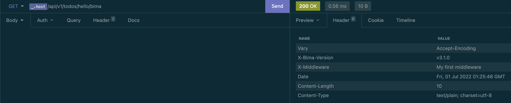

But when you open `/api/v1/todos` or any page others, your middleware is not exists. Yes, your can also add middleware for specific route with easy.

### Add new route to swagger

By default, your custom route is not automatically added to swagger, you need to add manually. Open `todo.swagger.json` in `swaggers` folder using [Swagger Editor](https://editor.swagger.io) add this lines

```json
"/api/v1/todos/hello/{name}": {
    "get": {
    "operationId": "Todos_Hello_World",
    "responses": {
        "200": {
        "description": "A successful response.",
            "schema": {
                "type": "string"
            }
        },
        "default": {
            "description": "An unexpected error response.",
            "schema": {
                "$ref": "#/definitions/rpcStatus"
            }
        }
    },
    "parameters": [
        {
            "name": "name",
            "in": "path",
            "required": true,
            "type": "string"
        }
    ],
    "tags": [
            "Todos"
        ]
    }
}
```

Rerun again and open `/api/docs` and your custom route is already there

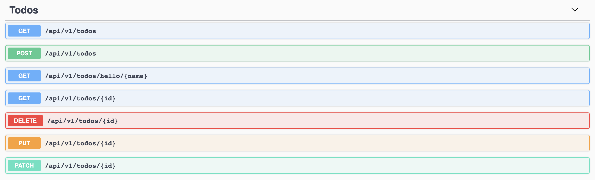

### Use MongoDB

By default, skeleton configured for RDBMS that defined in `dics/container.go` using `bima:repository:gorm`, you can just change to `bima:repository:mongo` when you want to change to MongoDB. You need to change `DB_DRIVER`, `DB_HOST`, `DB_PORT`, `DB_NAME`, `DB_USER`, and `DB_PASSWORD` values depend on your setting

```bash
DB_DRIVER=mongo
DB_HOST=localhost
DB_PORT=27017
DB_NAME=bima_skeleton
DB_USER=mongo
DB_PASSWORD=s3cr3t
```

### Add Logrus Hook

For example, you want to add [Elasticsearch Hook](https://github.com/sohlich/elogrus), just add code below to `dics/container.go`

```go
{
    Name: "bima:logger:extension:elasticsearch",
    Scope: bima.Application,
    Build: func(client *elastic.Client) (*elogrus.ElasticHook, error) {
        return elogrus.NewAsyncElasticHook(client, "localhost", logrus.DebugLevel, "mylog")
    },
    Params: dingo.Params{
        "0": dingo.Service("bima:elasticsearch:client"),
    },
},
```

And then register your extension to `configs/loggers.yaml`

```yaml
loggers:
    - elasticsearch
```

Don't forget to add `ELASTICSEARCH_HOST` and `ELASTICSEARCH_PORT` to your `.env`

### Using Yaml or Json config

To run application using yaml or json config, you can run using `bima run -f <path>`

### Remove module

To remove module, just run `bima module remove <name>`

### Tutorial

- [x] [Jwt Login](docs/jwt.md)

- [x] [Basic Auth](docs/basic.md)

- [x] [Distributed Tracing (RequestID)](docs/requestid.md)

- [x] [Enable CORS](docs/cors.md)

- [x] [Add Custom Action](docs/custom_action.md)

- [x] [Sync data to Elasticsearch](docs/sync_to_elasticsearch.md)

- [x] [Use Elasticsearch paginator](docs/elasticsearch_paginator.md)

- [x] [Use Pub/Sub to publish and consume message (AMQP)](docs/pub_sub.md)

- [x] [Convert Mux Middleware to Bima Middleware](docs/convert_middleware.md)

- [x] [Create Your Own Database Driver](docs/driver.md)

- [x] [Use MongoDB as Storage Driver](docs/mongodb.md)

- [x] [Use Kafka in Message Broker](docs/kafka.md)

- [x] [Debugging Skeleton](docs/debug.md)

### Middlewares

- [x] [Basic Auth](docs/basic.md)

- [x] [Jwt Auth](docs/jwt.md)

- [x] [RequestID](docs/requestid.md)

- [x] [CORS](docs/cors.md)

- [x] [Helmet](docs/helmet.md)

- [x] [Rate Limiter](docs/convert_middleware.md)
